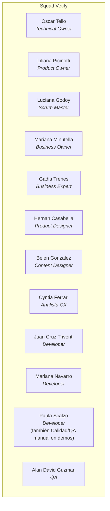
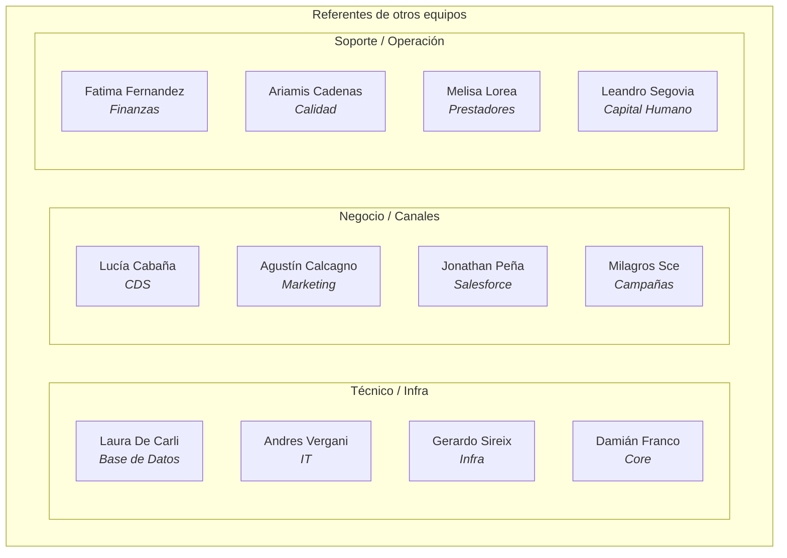

# Organigrama del squad — BORRADOR

> ⚠️ **Borrador, no confirmado.** Este organigrama es un **borrador armado a partir de menciones
> sueltas** en `project-context.md` y el resto de `knowledge/` — no hay una fuente única de "quién
> reporta a quién" documentada todavía. Por eso agrupa personas por función/equipo, pero **no
> dibuja líneas de reporte** (eso sería inventar algo que no está confirmado). Alan va a traer la
> info real el próximo lunes (2026-09-21) — cuando eso pase, reemplazar este archivo por la
> versión definitiva.

## Squad Vetify (core)

| Persona | Rol |
|---|---|
| Luciana Godoy | Scrum Master |
| Liliana Picinotti | Product Owner |
| Juan Cruz Triventi | Developer |
| **Oscar Tello** | **Technical Owner** |
| Mariana Navarro | Developer |
| Cyntia Ferrari | Analista CX (Customer Experience) |
| Paula Scalzo | Developer (también opera como Calidad/QA manual en demos) |
| Belen Gonzalez | Content Designer |
| Alan David Guzman | QA |
| Hernan Casabella | Product Designer |
| Mariana Minutella | Business Owner |
| Gadia Trenes | Business Expert |

## Referentes de otros equipos

Gente fuera del squad core que aparece repetidas veces como punto de contacto real en el
conocimiento acumulado — agrupados por el área que representan, según las menciones existentes.

**Consultor técnico**: Alexis Castellano ("Alex" — `acastellano@ikeasistencia.com.ar`, la cuenta
real que se usa para probar Reintegros/Prestadores, no solo una cuenta de test).

**Equipo Soluciones** (administra Engage, sistema central de afiliados — ver `system-knowledge.md`
§ Reintegros): **Leonel** (responsable real del acceso de administración de Engage en QA), Pablo
Mendoza (referente técnico, autor de la colección Postman real del equipo).

**Equipo COP** (dueño del backend Quantum/`qa-quantum.ike.ar` — ver `system-knowledge.md` §
Integración Quantum): sin nombre de referente individual confirmado todavía, escalar ahí según
Oscar Tello.

## Qué falta para que esto deje de ser un borrador

- Confirmar si hay una jerarquía de reporte real (quién responde a quién) o si el squad funciona
  sin ese nivel de formalidad.
- Validar que los roles de la tabla sigan vigentes (esta lista viene de `project-context.md`,
  sembrada 2026-08-21 desde `automation`).
- Agregar foto/avatar y contacto (Slack/email) de cada persona si se quiere un directorio
  navegable, no solo un diagrama.
